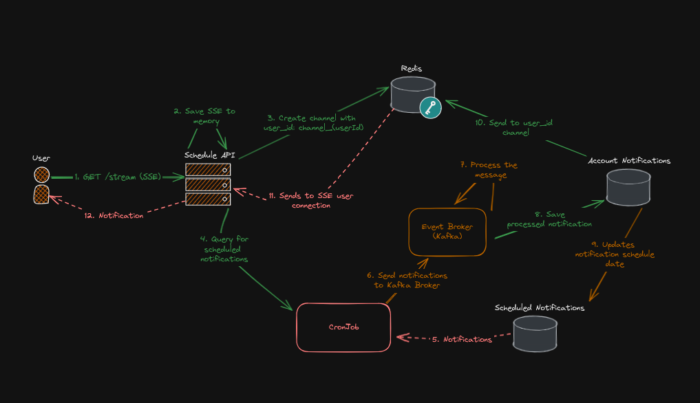
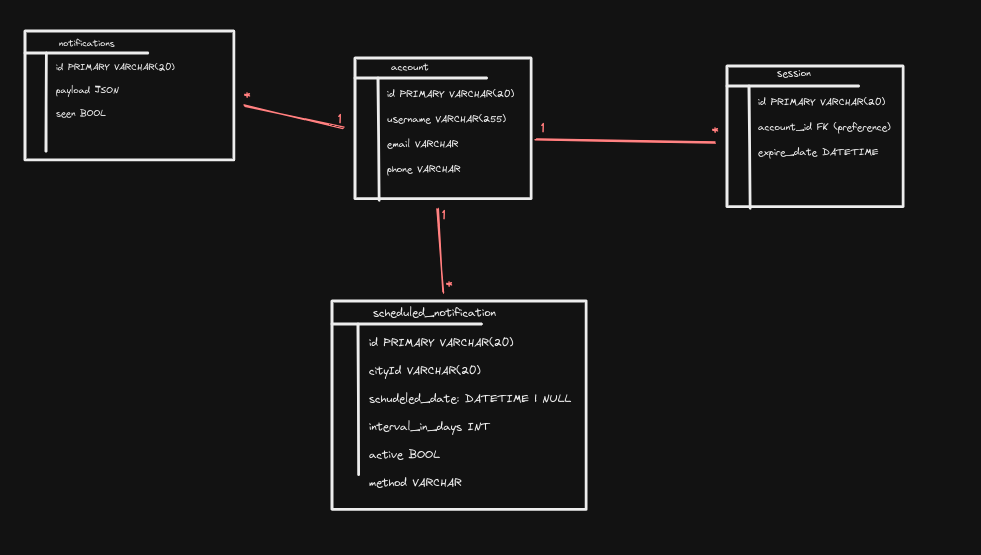

# Weather Notification System

## Como rodar

## Execute o seguinte script:

---

1. Instale as dependências com `chmod +x ./install.sh && ./install.sh`
2. Na raiz, Inicie os containers com `docker compose up -d` e espere os containers subirem
3. Inicie a aplicação com `chmod +x ./start.sh && ./start.sh`

## Tecnologias

---

- Kafka
- Go
- React (Remix) SSR
- Redis

## Diagramas

---

Fluxo:

1. O usuário se conecta com a API por SSE
2. Um canal de comunicação com o Redis é criado
3. Um CRON JOB realiza o pooling de mensagems agendadas
4. O cron job envia as mensagens agendadas para o broker do kafka
5. As mensagens são processadas por um handler definido no sistema. Além disso, messagens não processadas devem ser enviadas para um DLQ
6. Mensagens processadas são salvas no banco e a data da próxima notificação é calculada
7. Por fim, o broker envia para o canal da conta do usuário no Redis a mensagem
8. Caso o usuário estiver conectado, a mensagem é exibida no frontend.



Banco:



### Autenticação

---

- `/v1/register` - Registra um usuário

```json
{
  "name": "name",
  "username": "username",
  "password": "password",
  "email": "email",
  "phone": "phone"
}
```

- `/v1/login` - Autentica um usuário
  - Resposta: Popula nos cookies o id da sessão do usuário

```json
{
  "username": "username",
  "password": "password"
}
```

- `/v1/session` - Retorna os dados da sessão do usuário, se houver cookies na sessão

```json
// Resposta
{
  "email": "email",
  "id": "id",
  "name": "name",
  "phone": "phone",
  "username": "username"
}
```

### Sistema de Notificações

---

- `GET /v1/account/notifications` - Retorna todas as notificações já enviadas ao usuário na sessão

- `GET /v1/stream` - Conecta-se ao servidor para receber eventos via SSE

- `POST /v1/account/schedules` - Agenda uma notificação

```json
// Body
{
  "hour": "number",
  "intervalInDays": "number",
  "cityId": "id_da_cidade",
  "method": "WEB | EMAIL | SMS",
  "isCoastalCity": "bool"
}
```

- `GET /v1/account/schedules` - Lista notificações agendadas

- `DELETE /v1/account/schedules/:id` - Desativa uma notificação agendada

- `PATCH /v1/account/schedules/:id` - Ativa uam notificação agendada

### Frontend

- As rotas do frontend consistem em:
  - `/login`: Tela básica de usuário e senha
  - `/schedules/list`: View que informa as notificações agendadas do usuário
  - `/schedules/notifications`: Tela responsável por abrir a conexão SSE e streamer notificações de clima para o cliente
  - `/schedules/schedule`: Tela agendar notificações
    - Limitação: É necessário do id da cidade no campo cidade.
