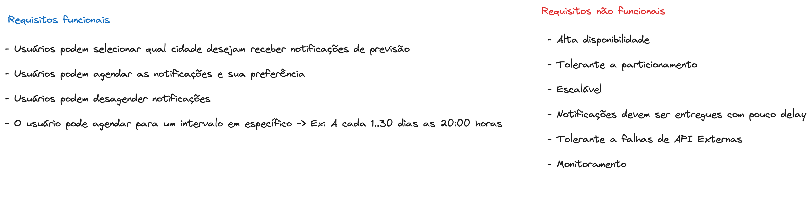
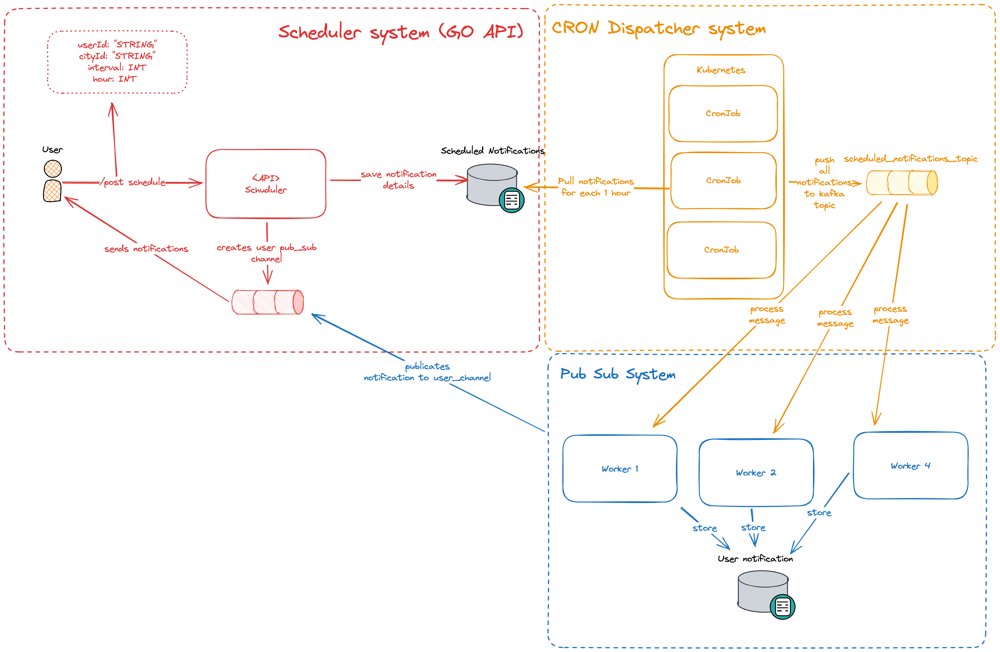
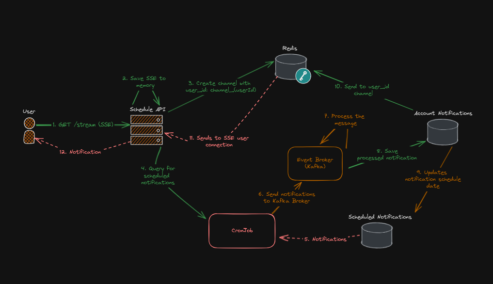
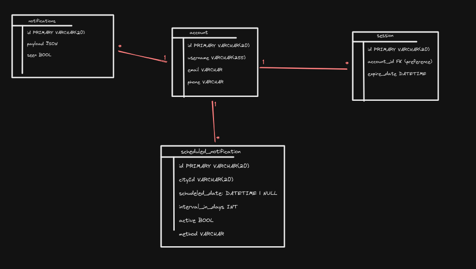

# Weather Notification System

## Como rodar

## Execute o seguinte script:

1. Instale o bun com `curl -fsSL https://bun.sh/install | bash`
2. Instale as dependências com `chmod +x ./install.sh && ./install.sh` (Backend - Go, Frontend - Bun)
3. Na raiz, Inicie os containers com `docker compose up -d` e espere os containers subirem
4. Inicie a aplicação com `chmod +x ./start.sh && ./start.sh`

## Tecnologias

- Kafka
- Go
- React (Remix) SSR
- Redis

## Diagramas

### Requisitos


### Arquitetura:


### Fluxo:

1. O usuário se conecta com a API utilizando SSE (Server-Sent Events) e um canal de comunicação exclusivo do usuário é criado no Redis para envio de mensagens em tempo real.
2. Um CRON JOB realiza o pooling de mensagems agendadas e envia as mensagens agendadas para o broker do Kafka.
4. O handler de mensagens para o tópico de notificações agendadas do Kafka, chama a API de Clima do CPTEC, salva a notificação no banco e calcula a data da próxima notificação.
5. Por fim, o broker envia para o canal da conta do usuário no Redis a mensagem.
6. Caso o usuário estiver conectado, a mensagem é exibida no frontend.



### Banco (alto nível):



### Autenticação

- `/v1/register` - Registra um usuário

```json
{
  "name": "name",
  "username": "username",
  "password": "password",
  "email": "email",
  "phone": "phone"
}
```

```sh
curl --request POST \
  --url http://localhost:8001/v1/register \
  --data '{
  "name": "name",
  "username": "username",
  "password": "password",
  "email": "any_email@gmail.com",
  "phone": "(11)1111-1111"
}'
```

- `/v1/login` - Autentica um usuário
  - Resposta: Popula nos cookies o id da sessão do usuário

```json
{
  "username": "username",
  "password": "password"
}
```

- `/v1/session` - Retorna os dados da sessão do usuário, se houver cookies na sessão

```json
// Resposta
{
  "email": "email",
  "id": "id",
  "name": "name",
  "phone": "phone",
  "username": "username"
}
```

### Sistema de Notificações

- `GET /v1/account/notifications` - Retorna todas as notificações já enviadas ao usuário na sessão

- `GET /v1/stream` - Conecta-se ao servidor para receber eventos via SSE

- `POST /v1/account/schedules` - Agenda uma notificação por hora, intervalo, cidade e método.

```json
// Body
{
  "hour": "number",
  "intervalInDays": "number",
  "cityId": "id_da_cidade",
  "method": "WEB | EMAIL | SMS",
  "isCoastalCity": "bool"
}
```

- `GET /v1/account/schedules` - Lista notificações agendadas

- `DELETE /v1/account/schedules/:id` - Desativa uma notificação agendada

- `PATCH /v1/account/schedules/:id` - Ativa uam notificação agendada

### Frontend

- As rotas do frontend consistem em:
  - `/login`: Tela básica de usuário e senha
  - `/schedules/list`: View que informa as notificações agendadas do usuário
  - `/schedules/notifications`: Tela responsável por abrir a conexão SSE e streamar notificações de clima para o cliente
  - `/schedules/schedule`: Tela agendar notificações para uma determinada cidade, em um intervalo e uma hora
    - Limitação: É necessário do id da cidade no campo cidade.
